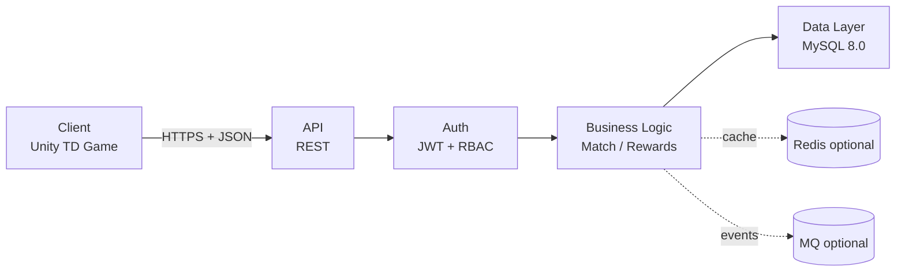
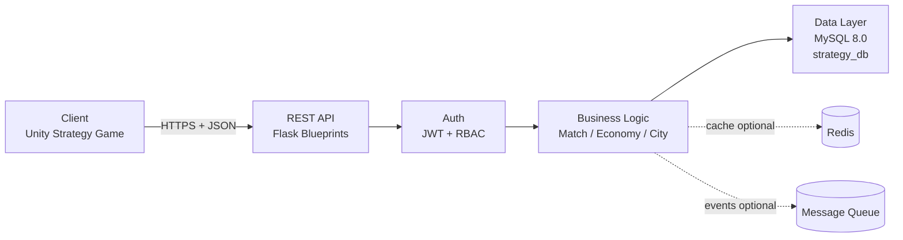
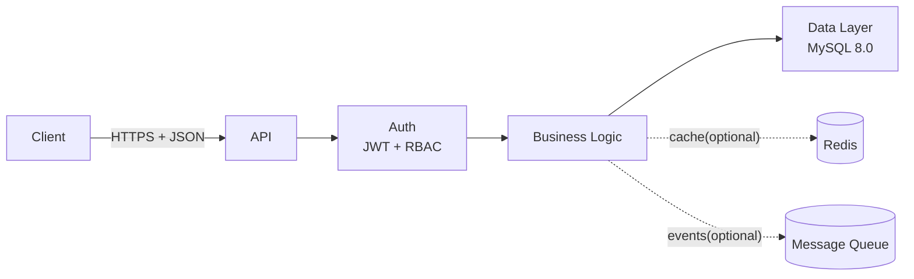

# 2. Практика. 1. Архитектура

## 1.1. Задание к разделу «Архитектура»

### 1.1.1. Необходимо выполнить

1. Создать архитектурную схему ИС сопровождения игрового продукта.
2. Описать один серверный сценарий прохождения запроса через систему.
3. Оформить всё в файле:

```text
docs/01-architecture.md
```

---

## 1.2. Архитектурная схема

### 1.2.1. Требования к схеме

Схема должна быть выполнена в формате **Mermaid flowchart** и содержать строго 5 блоков:

* **Client**
* **API**
* **Auth (JWT + RBAC)**
* **Business Logic**
* **Data Layer (MySQL + optional Redis/MQ)**

Обязательно:

* указать направление запроса (Client → API → Auth → Business Logic → DB);
* указать протокол передачи данных (HTTPS + JSON);
* показать последовательность прохождения запроса;
* не добавлять лишние блоки (например, CDN, Nginx, Docker — если они не входят в минимальный контур).

---

### 1.2.2. Методическое пояснение (как адаптировать под свою игру)

При адаптации схемы под свою игру необходимо:

* заменить абстрактный Client на конкретный:

  * Unity (2D/3D),
  * Web (React/Vue),
  * Mobile (Android/iOS);

* указать назначение Business Logic (что именно делает сервер в вашей игре), например:

  * Match Service (матчи / сессии),
  * Economy Engine (валюта / ресурсы / покупки),
  * Achievement Engine (достижения),
  * City Service (строительство / улучшения),
  * Quest Service (квесты / задания);

* при необходимости показать optional-компоненты:

  * Redis — кэш (профиль, лидерборд, сессии),
  * MQ — обработка событий (лог событий, аналитика, античит, уведомления).

⚠ Важно:  
Схема должна отражать **архитектуру сопровождения игрового продукта**, а не просто "сайт + БД".  
То есть обязательно присутствует игровой сценарий: матч/бой, строительство, прогресс, экономика, события, рейтинги.

---

## 1.3. Описание одного серверного сценария

### 1.3.1. Выбор endpoint

Выбрать один endpoint:

* `POST /api/v1/auth/login`
* `POST /api/v1/match/finish`
* `GET /api/v1/profile`

---

### 1.3.2. Описание должно включать

Описание должно включать:

* пример HTTP-запроса;
* проверки Auth;
* валидацию;
* действия Business Logic;
* SQL-запросы;
* JSON-ответ;
* минимум 2 возможные ошибки.

---

### 1.3.3. Методическое пояснение (как выбрать сценарий под жанр)

При адаптации под свою игру:

* Если это **RPG** → можно описать `POST /api/v1/battle/complete`
* Если это **Tower Defense** → `POST /api/v1/match/finish`
* Если это **Shooter** → `POST /api/v1/session/end`
* Если это **Idle / Simulator** → `POST /api/v1/economy/collect`
* Если это **Strategy** → `POST /api/v1/match/finish`

Главное — показать:

1. Что расчёты выполняются **на сервере**, а не доверяются клиенту.
2. Что используется транзакция.
3. Что обновляются связанные таблицы (progress/resources/leaderboard/rewards).
4. Что предусмотрены ошибки конкурентного доступа (race condition, повторная отправка).
5. Что входные данные валидируются (типы, диапазоны, принадлежность объекта пользователю).

---

## 1.4. Требования к проекту (Flask)

### 1.4.1. Рекомендуемый стек

* Язык: **Python 3.10+**
* Web-фреймворк: **Flask**
* База данных: **MySQL 8.0**
* ORM (рекомендуется): **SQLAlchemy**
* Миграции (рекомендуется): **Flask-Migrate**
* Аутентификация: **JWT** (например, `flask-jwt-extended`)
* Хэширование паролей: **bcrypt**
* Формат обмена данными: **JSON**
* Протокол: **HTTPS**

---

## 1.5. Структура проекта (Flask)

Реальная структура проекта `strategy-support-is`:

```text
project-root/
│
├── docs/
│   └── 01-architecture.md
│
├── db/
│   └── schema.sql
│
├── app/
│   ├── __init__.py          ← create_app(), регистрация blueprint'ов
│   ├── config.py            ← Config (читает .env)
│   ├── extensions.py        ← db, jwt, cors
│   │
│   ├── routes/
│   │   ├── auth.py
│   │   ├── match.py
│   │   ├── profile.py
│   │   ├── events.py
│   │   ├── leaderboard.py
│   │   └── health.py
│   │
│   ├── controllers/
│   │   ├── auth_controller.py
│   │   ├── match_controller.py
│   │   ├── profile_controller.py
│   │   ├── events_controller.py
│   │   └── leaderboard_controller.py
│   │
│   ├── services/
│   │   ├── auth_service.py
│   │   ├── match_service.py
│   │   ├── profile_service.py
│   │   ├── events_service.py
│   │   └── leaderboard_service.py
│   │
│   ├── repositories/
│   │   ├── users_repo.py
│   │   ├── roles_repo.py
│   │   ├── matches_repo.py
│   │   ├── progress_repo.py
│   │   ├── stats_repo.py
│   │   ├── leaderboard_repo.py
│   │   ├── events_repo.py
│   │   └── dedupe_repo.py
│   │
│   └── middleware/
│       ├── request_id.py
│       ├── auth_jwt.py
│       ├── validate_api.py
│       └── error_handler.py
│
├── seed.sql
├── test_client.html
└── wsgi.py                  ← точка входа (python wsgi.py)
```

> **Конфигурация** хранится в `app/config.py` и читает переменные из `.env`.  
> Точка запуска — `wsgi.py`.

---

## 1.6. Как создать файл `docs/01-architecture.md`

1. Создать папку `docs`
2. Создать файл `01-architecture.md`
3. Вставить в файл:

   * Mermaid-схему
   * описание одного сценария
   * SQL
   * JSON

---

## 1.7. Пример выполнения (Tower Defense)

### 1.7.1. Архитектурная схема



---

### 1.7.2. Сценарий: `POST /api/v1/match/finish`

#### 1.7.2.1. Клиентский запрос

```http
POST /api/v1/match/finish
Authorization: Bearer <JWT>
Content-Type: application/json
```

```json
{
  "matchId": 987654321,
  "result": {
    "isWin": true,
    "score": 12450,
    "durationSeconds": 410,
    "waveReached": 12
  }
}
```

---

#### 1.7.2.2. Auth (JWT + RBAC)

Проверяется:

* JWT валиден
* `userId` извлечён (например `15`)
* роль = `player`

Ошибка:

```http
401 Unauthorized
```

---

#### 1.7.2.3. Validation

Проверяется:

* матч существует
* матч принадлежит `userId`
* статус матча = `started`
* матч ещё не завершён

Ошибка:

```http
409 Conflict
```

---

#### 1.7.2.4. Business Logic

Расчёт наград (сервер рассчитывает сам):

```text
xp = 50 + (waveReached * 10)
softCurrency = 100 + (waveReached * 20)
```

Для `waveReached = 12`:

```text
xp = 170
softCurrency = 340
```

---

#### 1.7.2.5. Data Layer (MySQL, транзакция)

```text
START TRANSACTION;
```

Закрытие матча:

```sql
UPDATE matches
SET status = 'finished',
    ended_at = CURRENT_TIMESTAMP(3)
WHERE id = 987654321;
```

Запись результата:

```sql
INSERT INTO battle_results
(match_id, is_win, score, duration_seconds)
VALUES
(987654321, 1, 12450, 410);
```

Обновление прогресса:

```sql
UPDATE player_progress
SET xp = xp + 170,
    soft_currency = soft_currency + 340
WHERE user_id = 15;
```

Обновление лидерборда:

```sql
INSERT INTO leaderboard_scores (user_id, board_code, season, score)
VALUES (15, 'default', 1, 12450)
ON DUPLICATE KEY UPDATE
  score = GREATEST(score, VALUES(score));
```

```text
COMMIT;
```

---

#### 1.7.2.6. Ответ сервера

```json
{
  "ok": true,
  "data": {
    "matchId": 987654321,
    "isWin": true,
    "xpGained": 170,
    "softCurrencyGained": 340
  }
}
```

---

#### 1.7.2.7. Возможные ошибки (минимум 2)

* `401 Unauthorized` — JWT отсутствует/просрочен/невалиден.
* `409 Conflict` — матч уже завершён или не принадлежит пользователю.
* `404 Not Found` — matchId не существует (дополнительно, если хотите).

---

## 1.8. На что обратить внимание при адаптации под свою игру

### 1.8.1. Сервер — источник истины

* Нельзя доверять клиентским расчётам наград.
* Нельзя принимать XP и валюту "как есть".
* Все расчёты должны быть воспроизводимы сервером.

---

### 1.8.2. Целостность данных

* Использовать транзакции.
* Предусмотреть повторный запрос (idempotency).
* Защититься от двойной отправки.

---

### 1.8.3. Архитектурная чистота

Разделение слоёв обязательно:

* routes → только HTTP
* services → бизнес-логика
* repositories → SQL
* DB → хранение

---

### 1.8.4. Жанровая специфика

| Жанр      | Что обязательно отразить     |
| --------- | ---------------------------- |
| RPG       | инвентарь, квесты, XP        |
| Shooter   | матчи, K/D, рейтинг          |
| Strategy  | ресурсы, строительство       |
| Simulator | экономика, таймеры           |
| Idle      | начисление дохода по времени |

---

## 1.9. Пример выполнения (Strategy — Unity Strategy Game)

### 1.9.1. Архитектурная схема



---

### 1.9.2. Сценарий: `POST /api/v1/match/finish`

#### 1.9.2.1. Клиентский запрос

```http
POST /api/v1/match/finish
Authorization: Bearer <JWT>
Content-Type: application/json
```

```json
{
  "matchId": 9,
  "result": {
    "isWin": true,
    "score": 1850,
    "durationSeconds": 1200,
    "powerDelta": 50
  }
}
```

> Матч `id=9` принадлежит пользователю `alice` (user_id=1) и имеет статус `started` согласно `seed.sql`.

---

#### 1.9.2.2. Auth (JWT + RBAC)

Проверяется декоратором `@auth_required(roles=["player"])` в `app/routes/match.py`:

- `verify_jwt_in_request()` из `flask-jwt-extended`
- извлечён `userId` через `get_jwt_identity()`
- извлечены `roles` через `get_jwt()`
- проверено наличие роли `player`
- записано `g.user = {"userId": ..., "roles": [...]}`

Ошибка:

```http
401 Unauthorized
```

---

#### 1.9.2.3. Validation

Декоратор `@validate_match_finish` в `app/middleware/validate_api.py` проверяет:

- `matchId` — int
- `result.isWin` — bool
- `result.score` — int >= 0
- `result.durationSeconds` — int >= 0
- `result.powerDelta` — int или null (опционально)

Ошибка:

```http
400 Bad Request
```

---

#### 1.9.2.4. Business Logic

`app/services/match_service.py`:

1. `ensure_match_ownership_started()` — проверяет владение матчем и статус `started`
2. Рассчитывает награды по константам (клиент их не присылает):

```text
xp_gained   = 100  (isWin = true)  / 30  (isWin = false)
soft_gained = 50   (isWin = true)  / 10  (isWin = false)
```

---

#### 1.9.2.5. Data Layer (MySQL, транзакция)

```text
START TRANSACTION;
```

```sql
-- 1) Закрытие матча
UPDATE matches SET status = 'finished', ended_at = NOW(3) WHERE id = 9;
```

```sql
-- 2) Результат
INSERT INTO battle_results (match_id, is_win, score, duration_seconds)
VALUES (9, 1, 1850, 1200)
ON DUPLICATE KEY UPDATE is_win=VALUES(is_win), score=VALUES(score), duration_seconds=VALUES(duration_seconds);
```

```sql
-- 3) Защита от гонок
SELECT user_id FROM player_progress WHERE user_id = 1 FOR UPDATE;
```

```sql
-- 4) Начисление
UPDATE player_progress SET xp = xp + 100, soft_currency = soft_currency + 50 WHERE user_id = 1;
```

```sql
-- 5) Статистика
INSERT INTO statistics_daily (user_id, day, sessions_count, events_count, playtime_seconds, wins, losses, score_sum)
VALUES (1, CURDATE(), 0, 1, 1200, 1, 0, 1850)
ON DUPLICATE KEY UPDATE events_count=events_count+1, playtime_seconds=playtime_seconds+VALUES(playtime_seconds),
  wins=wins+VALUES(wins), losses=losses+VALUES(losses), score_sum=score_sum+VALUES(score_sum);
```

```sql
-- 6) Лидерборд
INSERT INTO leaderboard_scores (user_id, board_code, season, score)
VALUES (1, 'default', 1, 1850)
ON DUPLICATE KEY UPDATE score=GREATEST(score, VALUES(score)), updated_at=CURRENT_TIMESTAMP(3);
```

```text
COMMIT;
```

---

#### 1.9.2.6. Ответ сервера

```json
{
  "ok": true,
  "data": {
    "matchId": 9,
    "isWin": true,
    "xpGained": 100,
    "softCurrencyGained": 50
  }
}
```

---

#### 1.9.2.7. Возможные ошибки (минимум 2)

* `401 Unauthorized` — токен отсутствует/невалиден/просрочен.
* `409 Conflict` — матч уже завершён или статус ≠ `started`.
* `404 Not Found` — matchId не существует.
* `403 Forbidden` — матч принадлежит другому пользователю.

---

## 1.10. Шаблон для файла `docs/01-architecture.md`

```markdown
# 2. Практика. 1. Архитектура

**ФИО:** Иванов Иван Иванович
**Группа:** ДКИП-401гдрми
**Проект:** <название проекта>  
**Жанр:** <жанр игры>  
**Клиент:** <Unity / Web / Mobile>  
**Backend:** Flask + MySQL  
**Дата:** <дата>

---

## 1.1. Задание к разделу «Архитектура»

### 1.1.1. Цель

Кратко описать цель разработки архитектуры ИС сопровождения игрового продукта.

---

## 1.2. Архитектурная схема

### 1.2.1. Схема (Mermaid)



---

### 1.2.2. Пояснение к архитектуре

Опишите:

- какую роль выполняет Client;
- что делает API;
- что проверяет Auth;
- какие задачи решает Business Logic;
- какие данные хранит Data Layer;
- используются ли Redis / MQ и зачем.

---

## 1.3. Описание серверного сценария

### 1.3.1. Выбранный endpoint

`<указать endpoint>`

Примеры:

- `POST /api/v1/auth/login`
- `POST /api/v1/match/finish`
- `GET /api/v1/profile`

---

## 1.4. HTTP-запрос

```http
<пример HTTP-запроса>
```

```json
<пример JSON-тела запроса>
```

---

## 1.5. Auth (JWT + RBAC)

Указать:

- как проверяется JWT;
- какие данные извлекаются из токена;
- какие роли допускаются;
- какие ошибки возможны.

**Возможная ошибка:**

```http
401 Unauthorized
```

```json
{
  "ok": false,
  "error": {
    "code": "UNAUTHORIZED",
    "message": "JWT is missing/invalid/expired",
    "requestId": "req_abc123"
  }
}
```

---

## 1.6. Validation

Опишите проверки:

- существование объекта;
- принадлежность пользователю;
- корректность параметров;
- бизнес-ограничения (уровни, ресурсы, статус и т.д.).

**Возможная ошибка:**

```http
409 Conflict
```

```json
{
  "ok": false,
  "error": {
    "code": "CONFLICT",
    "message": "...",
    "requestId": "req_abc123"
  }
}
```

---

## 1.7. Business Logic

Опишите:

- какие расчёты выполняет сервер;
- какие данные обновляются;
- какие сущности участвуют;
- почему клиент не является источником истины.

Если есть формулы — привести:

```text
<пример расчёта>
```

---

## 1.8. Data Layer (MySQL, транзакция)

### 1.8.1. Начало транзакции

```text
START TRANSACTION;
```

---

### 1.8.2. SQL-запросы

```sql
-- пример SELECT
<SQL-запрос>
```

```sql
-- пример UPDATE
<SQL-запрос>
```

```sql
-- пример INSERT
<SQL-запрос>
```

---

### 1.8.3. Завершение транзакции

```text
COMMIT;
```

---

## 1.9. JSON-ответ сервера

```http
HTTP/1.1 200 OK
Content-Type: application/json
```

```json
{
  "ok": true,
  "data": {
    "<ключ>": "<значение>"
  }
}
```

---

## 1.10. Возможные ошибки (минимум 2)

### 1.10.1. 401 Unauthorized

Причина: <описание>

---

### 1.10.2. 409 Conflict

Причина: <описание>

---

### 1.10.3. (Опционально) 404 Not Found

Причина: <описание>

---

## 1.11. Архитектурные принципы проекта

Перечислить:

1. Сервер — источник истины.
2. Использование транзакций.
3. Stateless REST.
4. Разделение слоёв (routes / services / repositories / DB).
5. Защита от race condition (SELECT FOR UPDATE).
6. Дедупликация событий (processed_events).

---

## 1.12. Адаптация под жанр

| Жанр      | Какие элементы необходимо учесть |
|-----------|----------------------------------|
| RPG       |                                  |
| Shooter   |                                  |
| Strategy  |                                  |
| Simulator |                                  |
| Idle      |                                  |

---

## 1.13. Итог

Краткий вывод:

- соответствует ли архитектура модели  
  Client → API → Auth → Business Logic → DB;
- обеспечивается ли серверная валидация;
- обеспечивается ли целостность данных;
- предусмотрена ли масштабируемость.
```
