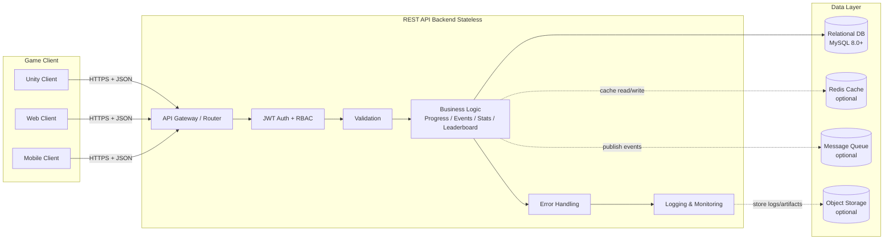
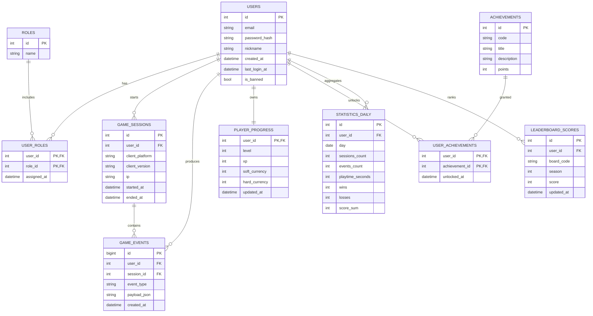
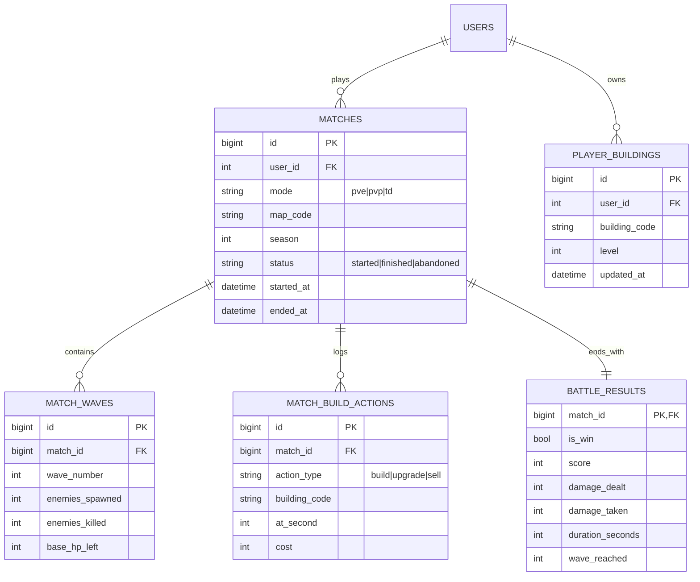

# 1. Теория. 1. Архитектурная модель ИС сопровождения игрового продукта

## 1.1. Что такое ИС сопровождения игрового продукта

ИС сопровождения игрового продукта — это **серверная часть**, которая принимает данные от клиента (Unity/Web/Mobile), применяет правила, сохраняет в БД и возвращает результаты (профиль, прогресс, лидерборды, статистику).

---

## 1.2. Клиент–серверная модель в игре

* **Клиент** отвечает за UI/UX и отправку действий/событий.
* **Сервер** отвечает за правила (начисления, прогресс), проверку, безопасность и хранение.
* **БД** — источник истины (история событий, прогресс, достижения, метрики).

---

## 1.3. Mermaid-схема архитектуры



---

## 1.4. Универсальная ER-модель данных

> Это **базовая универсальная схема** под сопровождение игрового продукта (Users/Roles/Sessions/Events/Progress/Achievements/Stats/Leaderboard).
> Далее её можно расширять под жанр (в т.ч. Strategy/Tower Defense).



---

## 1.5. Модификация схемы под MySQL 8.0 (вместо PostgreSQL)

Ниже — практичный вариант под **MySQL 8.0+**: `json`, `generated columns` для индексации JSON, `datetime(3)` для миллисекунд, `inet` заменяем на `varchar(45)`.

### 1.5.1. База: Users/Roles/Progress/Sessions/Events/Stats/Leaderboard (MySQL)

```sql
-- Рекомендуемо:
-- ENGINE=InnoDB, CHARSET=utf8mb4, COLLATION=utf8mb4_0900_ai_ci

CREATE TABLE roles (
  id   INT AUTO_INCREMENT PRIMARY KEY,
  name VARCHAR(32) NOT NULL UNIQUE
) ENGINE=InnoDB;

CREATE TABLE users (
  id            INT AUTO_INCREMENT PRIMARY KEY,
  email         VARCHAR(255) NOT NULL UNIQUE,
  password_hash VARCHAR(255) NOT NULL,
  nickname      VARCHAR(64)  NOT NULL,
  created_at    DATETIME(3)  NOT NULL DEFAULT CURRENT_TIMESTAMP(3),
  last_login_at DATETIME(3)  NULL,
  is_banned     TINYINT(1)   NOT NULL DEFAULT 0
) ENGINE=InnoDB;

CREATE TABLE user_roles (
  user_id   INT NOT NULL,
  role_id   INT NOT NULL,
  assigned_at DATETIME(3) NOT NULL DEFAULT CURRENT_TIMESTAMP(3),
  PRIMARY KEY (user_id, role_id),
  CONSTRAINT fk_user_roles_user FOREIGN KEY (user_id) REFERENCES users(id) ON DELETE CASCADE,
  CONSTRAINT fk_user_roles_role FOREIGN KEY (role_id) REFERENCES roles(id) ON DELETE RESTRICT,
  INDEX idx_user_roles_role_id (role_id)
) ENGINE=InnoDB;

CREATE TABLE game_sessions (
  id             INT AUTO_INCREMENT PRIMARY KEY,
  user_id        INT NOT NULL,
  client_platform ENUM('unity','web','mobile') NOT NULL,
  client_version VARCHAR(32) NULL,
  ip             VARCHAR(45) NULL,
  started_at     DATETIME(3) NOT NULL DEFAULT CURRENT_TIMESTAMP(3),
  ended_at       DATETIME(3) NULL,
  CONSTRAINT fk_sessions_user FOREIGN KEY (user_id) REFERENCES users(id) ON DELETE CASCADE,
  INDEX idx_sessions_user_started (user_id, started_at)
) ENGINE=InnoDB;

CREATE TABLE game_events (
  id          BIGINT AUTO_INCREMENT PRIMARY KEY,
  user_id     INT NOT NULL,
  session_id  INT NULL,
  event_type  VARCHAR(64) NOT NULL,
  payload_json JSON NOT NULL,
  created_at  DATETIME(3) NOT NULL DEFAULT CURRENT_TIMESTAMP(3),

  CONSTRAINT fk_events_user FOREIGN KEY (user_id) REFERENCES users(id) ON DELETE CASCADE,
  CONSTRAINT fk_events_session FOREIGN KEY (session_id) REFERENCES game_sessions(id) ON DELETE SET NULL,

  INDEX idx_events_user_time (user_id, created_at),
  INDEX idx_events_type_time (event_type, created_at)
) ENGINE=InnoDB;

CREATE TABLE player_progress (
  user_id        INT PRIMARY KEY,
  level          INT NOT NULL DEFAULT 1,
  xp             INT NOT NULL DEFAULT 0,
  soft_currency  INT NOT NULL DEFAULT 0,
  hard_currency  INT NOT NULL DEFAULT 0,
  updated_at     DATETIME(3) NOT NULL DEFAULT CURRENT_TIMESTAMP(3) ON UPDATE CURRENT_TIMESTAMP(3),

  CONSTRAINT fk_progress_user FOREIGN KEY (user_id) REFERENCES users(id) ON DELETE CASCADE,
  CONSTRAINT chk_level CHECK (level >= 1),
  CONSTRAINT chk_xp CHECK (xp >= 0),
  CONSTRAINT chk_soft CHECK (soft_currency >= 0),
  CONSTRAINT chk_hard CHECK (hard_currency >= 0)
) ENGINE=InnoDB;

CREATE TABLE achievements (
  id          INT AUTO_INCREMENT PRIMARY KEY,
  code        VARCHAR(64) NOT NULL UNIQUE,
  title       VARCHAR(128) NOT NULL,
  description TEXT NULL,
  points      INT NOT NULL DEFAULT 0,
  CONSTRAINT chk_points CHECK (points >= 0)
) ENGINE=InnoDB;

CREATE TABLE user_achievements (
  user_id        INT NOT NULL,
  achievement_id INT NOT NULL,
  unlocked_at    DATETIME(3) NOT NULL DEFAULT CURRENT_TIMESTAMP(3),

  PRIMARY KEY (user_id, achievement_id),
  CONSTRAINT fk_ua_user FOREIGN KEY (user_id) REFERENCES users(id) ON DELETE CASCADE,
  CONSTRAINT fk_ua_ach  FOREIGN KEY (achievement_id) REFERENCES achievements(id) ON DELETE CASCADE,
  INDEX idx_ua_ach (achievement_id)
) ENGINE=InnoDB;

CREATE TABLE statistics_daily (
  id               INT AUTO_INCREMENT PRIMARY KEY,
  user_id          INT NOT NULL,
  day              DATE NOT NULL,
  sessions_count   INT NOT NULL DEFAULT 0,
  events_count     INT NOT NULL DEFAULT 0,
  playtime_seconds INT NOT NULL DEFAULT 0,
  wins             INT NOT NULL DEFAULT 0,
  losses           INT NOT NULL DEFAULT 0,
  score_sum        INT NOT NULL DEFAULT 0,

  CONSTRAINT fk_stats_user FOREIGN KEY (user_id) REFERENCES users(id) ON DELETE CASCADE,
  UNIQUE KEY uq_stats_user_day (user_id, day),
  INDEX idx_stats_day (day),
  INDEX idx_stats_user_day (user_id, day)
) ENGINE=InnoDB;

CREATE TABLE leaderboard_scores (
  id         INT AUTO_INCREMENT PRIMARY KEY,
  user_id    INT NOT NULL,
  board_code VARCHAR(64) NOT NULL,
  season     INT NOT NULL DEFAULT 1,
  score      INT NOT NULL DEFAULT 0,
  updated_at DATETIME(3) NOT NULL DEFAULT CURRENT_TIMESTAMP(3) ON UPDATE CURRENT_TIMESTAMP(3),

  CONSTRAINT fk_lb_user FOREIGN KEY (user_id) REFERENCES users(id) ON DELETE CASCADE,
  UNIQUE KEY uq_lb_user_board_season (user_id, board_code, season),
  INDEX idx_lb_board_season_score (board_code, season, score),
  INDEX idx_lb_user (user_id),
  CONSTRAINT chk_season CHECK (season >= 1)
) ENGINE=InnoDB;
```

---

## 1.6. Жанровая адаптация: Strategy / Tower Defense (основной пример)

Ниже — **какие сущности добавляются**, **что хранить на сервере**, **какие метрики считать**.
Логика: стратегия — это набор **матчей/волн**, **юнитов**, **построек**, **экономики**, **результатов боя**.

### 1.6.1. Дополнительные сущности (Strategy/TD)

**Новые таблицы (минимально необходимые):**

* `matches` — матчи (PvE/PvP), состояние и результат
* `waves` — волны (для TD)
* `towers` / `buildings` — построенные объекты и их уровни
* `units` — юниты/враги (справочник типов)
* `player_inventory` — карты/ресурсы/улучшения
* `research` — исследования/таланты
* `battle_results` — итог матча (урон, потери, время, рейтинг)

### 1.6.2. Что хранить на сервере (чтобы было “правильно”)

**Сервер хранит и подтверждает:**

* результаты матча (win/lose, время, score);
* награды (gold, gems, опыт);
* апгрейды построек/юнитов;
* прогресс по уровням/главам/волнам;
* рейтинги и MMR (если PvP);
* античит-ограничения (лимиты ресурсов, допустимые значения).

**Клиент может хранить локально (кэш):**

* визуальные настройки;
* кеши конфигов (каталог башен/юнитов), но с обновлением с сервера.

### 1.6.3. Метрики (что считать и где)

**Операционные (для игрока):**

* win rate (wins / matches)
* average match duration
* best wave reached (TD)
* DPS / damage dealt
* resources spent / earned

**Продуктовые (для аналитики):**

* retention D1/D7/D30 (по login/session)
* churn (отсутствие входов N дней)
* conversion (если есть покупки)
* difficulty funnel (где чаще всего проигрывают)
* balance metrics (какие башни/юниты “имба”)

---

## 1.7. Strategy/TD: расширение ER (добавочные таблицы) + SQL (MySQL)

### 1.7.1. Mermaid ER (добавка к базовой)



### 1.7.2. Strategy/TD таблицы (MySQL)

```sql
CREATE TABLE matches (
  id         BIGINT AUTO_INCREMENT PRIMARY KEY,
  user_id    INT NOT NULL,
  mode       ENUM('pve','pvp','td') NOT NULL,
  map_code   VARCHAR(64) NOT NULL,
  season     INT NOT NULL DEFAULT 1,
  status     ENUM('started','finished','abandoned') NOT NULL DEFAULT 'started',
  started_at DATETIME(3) NOT NULL DEFAULT CURRENT_TIMESTAMP(3),
  ended_at   DATETIME(3) NULL,

  CONSTRAINT fk_matches_user FOREIGN KEY (user_id) REFERENCES users(id) ON DELETE CASCADE,
  INDEX idx_matches_user_time (user_id, started_at),
  INDEX idx_matches_mode_season (mode, season),
  CONSTRAINT chk_match_season CHECK (season >= 1)
) ENGINE=InnoDB;

CREATE TABLE match_waves (
  id              BIGINT AUTO_INCREMENT PRIMARY KEY,
  match_id        BIGINT NOT NULL,
  wave_number     INT NOT NULL,
  enemies_spawned INT NOT NULL DEFAULT 0,
  enemies_killed  INT NOT NULL DEFAULT 0,
  base_hp_left    INT NOT NULL DEFAULT 0,

  CONSTRAINT fk_waves_match FOREIGN KEY (match_id) REFERENCES matches(id) ON DELETE CASCADE,
  UNIQUE KEY uq_wave (match_id, wave_number),
  INDEX idx_waves_match (match_id),
  CONSTRAINT chk_wave_number CHECK (wave_number >= 1),
  CONSTRAINT chk_spawned CHECK (enemies_spawned >= 0),
  CONSTRAINT chk_killed CHECK (enemies_killed >= 0),
  CONSTRAINT chk_basehp CHECK (base_hp_left >= 0)
) ENGINE=InnoDB;

CREATE TABLE player_buildings (
  id            BIGINT AUTO_INCREMENT PRIMARY KEY,
  user_id       INT NOT NULL,
  building_code VARCHAR(64) NOT NULL,
  level         INT NOT NULL DEFAULT 1,
  updated_at    DATETIME(3) NOT NULL DEFAULT CURRENT_TIMESTAMP(3) ON UPDATE CURRENT_TIMESTAMP(3),

  CONSTRAINT fk_pb_user FOREIGN KEY (user_id) REFERENCES users(id) ON DELETE CASCADE,
  UNIQUE KEY uq_building (user_id, building_code),
  INDEX idx_buildings_user (user_id),
  CONSTRAINT chk_building_level CHECK (level >= 1)
) ENGINE=InnoDB;

CREATE TABLE match_build_actions (
  id            BIGINT AUTO_INCREMENT PRIMARY KEY,
  match_id      BIGINT NOT NULL,
  action_type   ENUM('build','upgrade','sell') NOT NULL,
  building_code VARCHAR(64) NOT NULL,
  at_second     INT NOT NULL,
  cost          INT NOT NULL DEFAULT 0,

  CONSTRAINT fk_actions_match FOREIGN KEY (match_id) REFERENCES matches(id) ON DELETE CASCADE,
  INDEX idx_actions_match_time (match_id, at_second),
  CONSTRAINT chk_at_second CHECK (at_second >= 0)
) ENGINE=InnoDB;

CREATE TABLE battle_results (
  match_id         BIGINT PRIMARY KEY,
  is_win           TINYINT(1) NOT NULL,
  score            INT NOT NULL DEFAULT 0,
  damage_dealt     INT NOT NULL DEFAULT 0,
  damage_taken     INT NOT NULL DEFAULT 0,
  duration_seconds INT NOT NULL DEFAULT 0,
  wave_reached     INT NOT NULL DEFAULT 0,

  CONSTRAINT fk_results_match FOREIGN KEY (match_id) REFERENCES matches(id) ON DELETE CASCADE,
  CONSTRAINT chk_damage_dealt CHECK (damage_dealt >= 0),
  CONSTRAINT chk_damage_taken CHECK (damage_taken >= 0),
  CONSTRAINT chk_duration CHECK (duration_seconds >= 0),
  CONSTRAINT chk_wave_reached CHECK (wave_reached >= 0)
) ENGINE=InnoDB;
```

---

## 1.8. Примеры SQL-запросов: leaderboard, winrate, difficulty funnel (MySQL)

### 1.8.1. Top N игроков по лидерборду (score DESC)

**Топ-100 по конкретной доске и сезону:**

```sql
SELECT
  ls.user_id,
  u.nickname,
  ls.score,
  ls.updated_at
FROM leaderboard_scores ls
JOIN users u ON u.id = ls.user_id
WHERE ls.board_code = 'td_score'
  AND ls.season = 1
ORDER BY ls.score DESC, ls.updated_at ASC
LIMIT 100;
```

**Позиция конкретного игрока (rank) — MySQL 8 window function:**

```sql
SELECT *
FROM (
  SELECT
    ls.user_id,
    u.nickname,
    ls.score,
    DENSE_RANK() OVER (ORDER BY ls.score DESC) AS rnk
  FROM leaderboard_scores ls
  JOIN users u ON u.id = ls.user_id
  WHERE ls.board_code = 'td_score' AND ls.season = 1
) t
WHERE t.user_id = 15;
```

---

### 1.8.2. Winrate игрока за период

**Winrate за последние 30 дней (по finished матчам):**

```sql
SELECT
  m.user_id,
  u.nickname,
  SUM(CASE WHEN br.is_win = 1 THEN 1 ELSE 0 END) AS wins,
  SUM(CASE WHEN br.is_win = 0 THEN 1 ELSE 0 END) AS losses,
  COUNT(*) AS matches,
  ROUND(100 * SUM(CASE WHEN br.is_win = 1 THEN 1 ELSE 0 END) / COUNT(*), 2) AS winrate_pct
FROM matches m
JOIN battle_results br ON br.match_id = m.id
JOIN users u ON u.id = m.user_id
WHERE m.status = 'finished'
  AND m.started_at >= (NOW(3) - INTERVAL 30 DAY)
  AND m.mode IN ('td','pve','pvp')
GROUP BY m.user_id, u.nickname
HAVING COUNT(*) >= 5
ORDER BY winrate_pct DESC, matches DESC;
```

---

### 1.8.3. Difficulty funnel (где чаще всего “отваливаются”) для TD по волнам

Идея: на какой волне игроки **чаще всего завершают матч поражением**.

**Считаем распределение поражений по `wave_reached`:**

```sql
SELECT
  br.wave_reached,
  COUNT(*) AS losses_count
FROM matches m
JOIN battle_results br ON br.match_id = m.id
WHERE m.mode = 'td'
  AND m.status = 'finished'
  AND br.is_win = 0
  AND m.season = 1
GROUP BY br.wave_reached
ORDER BY losses_count DESC, br.wave_reached ASC;
```

**Funnel по волнам: сколько матчей “дошли хотя бы до wave N”**
(часто нужно для баланса: где резкий спад прохождения)

```sql
SELECT
  w.wave_number,
  COUNT(DISTINCT w.match_id) AS matches_reached_wave
FROM match_waves w
JOIN matches m ON m.id = w.match_id
WHERE m.mode = 'td'
  AND m.status IN ('finished','abandoned')
  AND m.season = 1
GROUP BY w.wave_number
ORDER BY w.wave_number ASC;
```

---

## 1.9. Минимальные REST endpoints для Strategy/TD + JSON примеры

Ниже — “практический минимум” для матчей. Все запросы (кроме register/login) требуют JWT.

### 1.9.1. POST `/match/start`

**Назначение:** создать матч, открыть сессию матча, вернуть `matchId`.

**Request**

```http
POST /match/start
Authorization: Bearer <JWT>
Content-Type: application/json
```

```json
{
  "mode": "td",
  "mapCode": "forest_01",
  "season": 1,
  "clientVersion": "1.0.3"
}
```

**Response (201)**

```json
{
  "matchId": 987654321,
  "status": "started",
  "startedAt": "2026-02-25T22:10:12.345Z"
}
```

Ошибки:

* `400` неверные поля
* `401` нет/невалидный JWT
* `409` уже есть активный матч (если запрещаете параллельные)

---

### 1.9.2. POST `/match/event`

**Назначение:** фиксировать события матча (строительство, апгрейд, прохождение волны, урон базе и т.д.).

**Request**

```http
POST /match/event
Authorization: Bearer <JWT>
Content-Type: application/json
```

```json
{
  "matchId": 987654321,
  "eventType": "wave_end",
  "atSecond": 73,
  "payload": {
    "waveNumber": 3,
    "enemiesSpawned": 20,
    "enemiesKilled": 18,
    "baseHpLeft": 85
  }
}
```

**Response (200)**

```json
{
  "ok": true
}
```

Пример события строительства:

```json
{
  "matchId": 987654321,
  "eventType": "build",
  "atSecond": 12,
  "payload": {
    "buildingCode": "tower_arrow",
    "cell": { "x": 5, "y": 7 },
    "cost": 100
  }
}
```

---

### 1.9.3. POST `/match/finish`

**Назначение:** завершить матч, записать `battle_results`, обновить прогресс/статистику/leaderboard транзакционно.

**Request**

```http
POST /match/finish
Authorization: Bearer <JWT>
Content-Type: application/json
```

```json
{
  "matchId": 987654321,
  "result": {
    "isWin": true,
    "score": 12450,
    "durationSeconds": 410,
    "waveReached": 12,
    "damageDealt": 56000,
    "damageTaken": 12000
  },
  "rewards": {
    "xp": 150,
    "softCurrency": 300
  }
}
```

**Response (200)**

```json
{
  "matchId": 987654321,
  "status": "finished",
  "serverAccepted": true,
  "updatedProgress": {
    "level": 6,
    "xp": 2450,
    "softCurrency": 1200,
    "hardCurrency": 10
  },
  "leaderboardUpdate": {
    "boardCode": "td_score",
    "season": 1,
    "newScore": 12450
  }
}
```

Ошибки:

* `400` неконсистентные значения
* `403` матч не принадлежит пользователю
* `409` матч уже завершен

---

### 1.9.4. GET `/match/{id}`

**Назначение:** получить детали матча (для истории, отладки, реплея, админки).

**Request**

```http
GET /match/987654321
Authorization: Bearer <JWT>
```

**Response (200)**

```json
{
  "match": {
    "id": 987654321,
    "mode": "td",
    "mapCode": "forest_01",
    "season": 1,
    "status": "finished",
    "startedAt": "2026-02-25T22:10:12.345Z",
    "endedAt": "2026-02-25T22:17:02.120Z"
  },
  "result": {
    "isWin": true,
    "score": 12450,
    "durationSeconds": 410,
    "waveReached": 12
  },
  "waves": [
    { "waveNumber": 1, "enemiesSpawned": 10, "enemiesKilled": 10, "baseHpLeft": 100 },
    { "waveNumber": 2, "enemiesSpawned": 15, "enemiesKilled": 14, "baseHpLeft": 92 }
  ],
  "eventsCount": 57
}
```

---

## 1.10. Античит-валидация (что проверять на сервере)

Цель: сервер должен принимать только **правдоподобные** и **согласованные** результаты. В производственной практике это обычно “базовый античит”, без ML.

### 1.10.1. Общая политика доверия

* Клиент **не источник истины**, клиент — “заявка”.
* Сервер решает:

  * можно ли принять матч;
  * какие награды выдать;
  * что попадет в лидерборд.

### 1.10.2. Валидация на `/match/start`

Проверять:

* `mode`, `mapCode`, `season` существуют и разрешены.
* игрок не забанен (`users.is_banned`).
* нет активного матча (если правило “один матч одновременно”).
* лимит частоты: не чаще N стартов в минуту (rate limit).

### 1.10.3. Валидация на `/match/event`

Проверять:

* матч существует, принадлежит `userId` из JWT, статус `started`.
* `atSecond` не уходит назад (монотонность) или допускается малый лаг (±2 сек).
* тип события входит в белый список.
* payload соответствует схеме (json schema / ручная валидация):

  * `waveNumber` >= 1
  * `enemiesKilled <= enemiesSpawned`
  * `baseHpLeft` в диапазоне [0..maxBaseHp]
* частота событий: не больше X событий/сек (защита от спама).

**Для build/upgrade:**

* у игрока хватало ресурсов на момент события (сервер ведет “серверный баланс”).
* апгрейд возможен (уровень здания не превышает max, есть prerequisites).
* координаты клетки допустимы (в пределах карты, не занято).

> Практический минимум: сервер не обязан “симулировать бой”, но обязан проверять **экономику** и **структурные ограничения**.

### 1.10.4. Валидация на `/match/finish` (самое важное)

Проверять консистентность:

* матч `started`, не завершен.
* `durationSeconds` согласуется с (ended_at - started_at):

  * допускайте погрешность, но ловите явные фейки (например, 30 сек вместо 10 мин).
* `waveReached` согласуется с последними `match_waves`:

  * нельзя заявить `waveReached=20`, если событий/волн максимум 7.
* `score` должен быть в допустимом диапазоне для карты/режима/длительности:

  * правило “верхней границы” = простая защита от миллионов очков.
* `damageDealt`, `damageTaken` не должны быть отрицательными и должны быть разумными для режима.

Проверять награды:

* **не принимать rewards от клиента как истину**.
* сервер сам рассчитывает награды по формуле:

  * `xp = baseXp(map) + k * waveReached + winBonus`
  * `softCurrency = base + waveReached * factor`
* если клиент прислал rewards — используйте только как “пожелание”, но сравнивайте и режьте до серверного значения.

Проверять обновление leaderboard:

* в leaderboard идут только результаты:

  * завершенные матчи
  * без флагов подозрения
  * при необходимости — только `is_win=1` или только ranked режим

### 1.10.5. “Флаги подозрительности” (без блокировок, но для логов)

Ставьте `suspicion_flags` (можно в таблицу `matches` или отдельную):

* слишком высокая скорость набора очков: `score / durationSeconds > threshold`
* слишком быстрый прогресс уровня
* слишком частые матчи/час
* несоответствие волн/очков/длительности

Даже если принимаете результат, **логируйте**:

* userId, matchId, значения, причина флага.

---

## 1.11. Рекомендуемая серверная транзакция на finish (логика)

На `POST /match/finish` делайте атомарно (в одной транзакции):

1. закрыть матч (`matches.status='finished', ended_at=now`)
2. записать `battle_results`
3. начислить награды → обновить `player_progress`
4. обновить `statistics_daily`
5. обновить `leaderboard_scores` (upsert)

Для MySQL: `START TRANSACTION; ... COMMIT;`
Для upsert: `INSERT ... ON DUPLICATE KEY UPDATE ...`

Пример upsert в лидерборд:

```sql
INSERT INTO leaderboard_scores (user_id, board_code, season, score)
VALUES (?, 'td_score', ?, ?)
ON DUPLICATE KEY UPDATE
  score = GREATEST(score, VALUES(score)),
  updated_at = CURRENT_TIMESTAMP(3);
```
